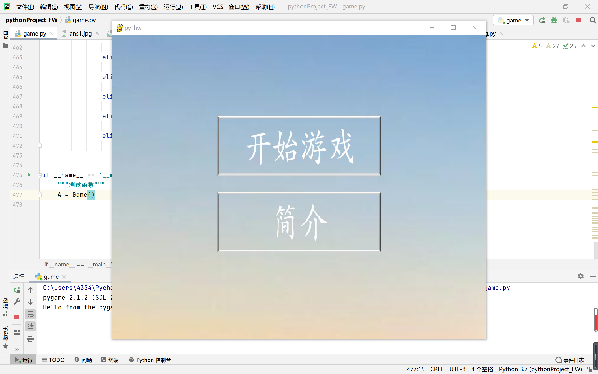
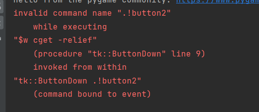

# 基于扫雷游戏对深圳大学的地图探索

> python程序设计  期末大作业 --  **深大扫雷式探索** 
>
> 项目实现时间： 2022/06/14~2022/06/23
>
> 完成时间：2022/06/23
>
> 作者 ：梁圣钊，郑彦薇，梁素敏

> 演示时间：2022/06/24

> 项目分工：
>
> 梁圣钊：数据处理、代码实现、汇报及报告攥写
>
> 郑彦薇：数据处理、代码实现及报告完善
>
> 梁素敏：ppt制作


## 技术概述

### 代码设计

#### python文件的说明：

**block_condition：**定义方块状态类，根据游戏规则在该类中设定方块的6种状态——未被点击、点击、建筑块、标记为建筑、标记为问好、踩到建筑。

**data：**对深大地图数据的分割、转换和存储，使用矩阵存储地图数据信息。

**InitMine：**初始化方块信息，根据data中已处理的数据，遍历地图，获取方块的坐标和状态。

**setting：**设置游戏界面的数据——屏幕大小、地图大小、方块大小、显示字体和标签。

**game：**游戏实现的主要代码，设置游戏类，包含游戏初始化、游戏进行过程、游戏结果判断、建筑的展示等函数。

*列出game类中设计的函数功能说明如下：*

```python
def __init__(self):  # 初始化
    pass
def game_play(self):  #开始游戏
    pass
def show_building(self, event):  # 展示地图的建筑信息
    pass
def send_answer(self, event):  # 玩家选择答案、传递相应结果
    pass
def pd_answer(self, event):  # 终止mainloop，删除部件
    pass
def search_zero(self, event):  # 0递归打开
    pass
def continue_game(self, event):  # 继续游戏
    pass
def show_answer(self, event):  # 传递提示
    pass
def game_end(self, event):  # 结束游戏
    pass
def show_block(self):  # 展示所有格子
    pass
```


### 模块要求：

该项目实现无需借助第三方库，对于文件中调用的未安装的库，在终端中使用`pip install`指令进行安装即可。

项目中用到的库：

> sys, pygame, time, random, tkinter


## 项目安装、执行说明

下载代码文件安装包，解压后使用`PyCharm Community Edition 2020.3.3`打开，为文件配置解释器，运行`game.py`文件即可开始游戏。

**PyCharm 2020.3.3安装与解释器配置参考：**http://t.csdn.cn/AvqsL

**运行`game.py`文件，进入游戏：**




## 其他部分：

### 已知错误：

在游戏过程中，运行会出现以下报错：



```python
# 报错内容
invalid command name ".!button2"
	while executing
"$w cget -relief"
	(procedure "tk::ButtonDown" line 9)
    invoked from within
"tk::ButtonDown .!button2"
	(command bound to event)
```


原因解释：

运行程序时，由于pygame和tkinter对鼠标点击与松开的事件会发生冲突，控制台会报相关错误。但该错误并不影响程序对鼠标状态的判定以及程序的正常运行，因此我们认为是可忽略的错误。


### 项目维护者联系信息：

> 梁圣钊邮箱：2020151033@email.szu.edu.cn
>
> 郑彦薇邮箱：2020151022@email.szu.edu.cn


### 项目参考与致谢：

**项目参考：**

> 1. http://t.csdn.cn/RFLgm
> 2. pygame官方文档，tkinter PPT


**致谢：**

感谢课堂上无微不至地教学与指导我们的潘浩源老师，为我们完成项目奠定知识、能力的基础；感谢提出的宝贵建议的舍友与朋友们，为我们完成项目提供新的思路与想法。

